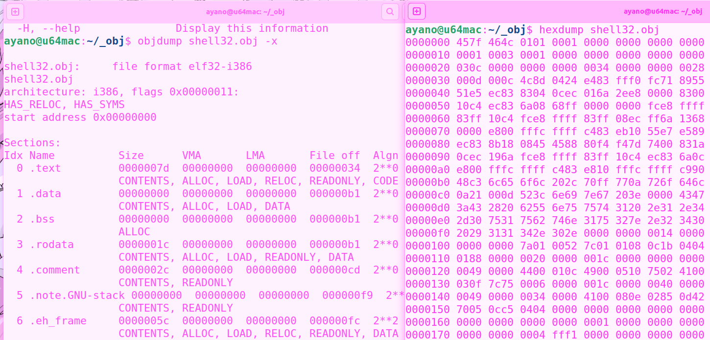
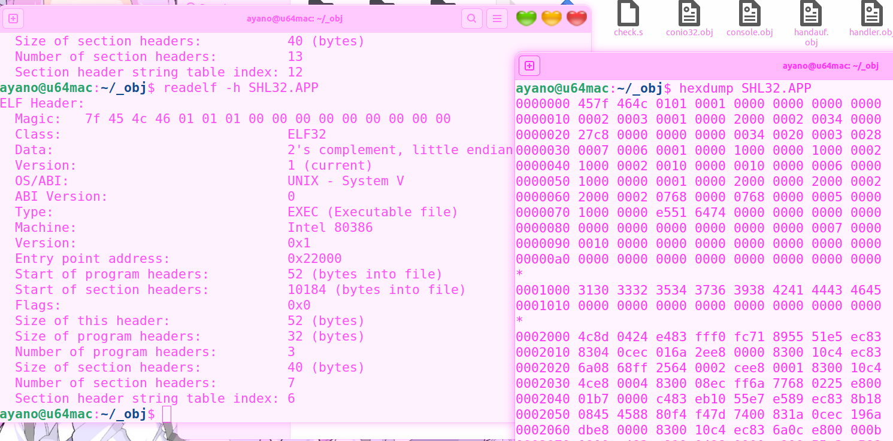

### 20240428 建模与实践

- [x] 应用于 Mecocoa x86

### 20240427 深入

- [x] 建模 ELF.h ELF.c

编写了 readelf.c

### 20240426 分析

​

不小心看错文件了，白白浪费了半个晚上。

​​

```asm
0000000 457f 464c : Magica Number
        0101 : LSByte(1: 32-bit, 2: 64-bit) MSByte(1: 2-complement, little endian)
        0001 : LSByte(1: ELF-Version) MSByte(0: OSABI - UNIX System V ABI)
        0000 : LSByte(EI_ABIVERSION) MSByte(EI_PAD)
        0000 0000 0000
0000010 0002 : e_type Executable file
        0003 : e_machine Intel 80386
        0001 0000 : EV_CURRENT
        2000 0002 : e_entry 0x22000
        0034 0000 : [Start of program headers]
0000020 27c8 0000 : [Start of section headers]
        0000 0000 : e_flags
        0034 : ELF Header size in bytes
        0020 : Program Header Entry的大小，即程序头部表的单个表项的大小
        0003 : Program Header Entry的数目，即程序头部表的表项数
        0028 : Section Header Entry的大小，即节区表的单个表项的大小
0000030 0007 : Section Header Entry的数目，即节区表的表项数
        0006 : 即节区名称表(.shstrtab)位于节区表的位置，用于索引节区的名字
[Program Header Table]
Program Headers:
  Type           Offset   VirtAddr   PhysAddr   FileSiz MemSiz  Flg Align
  LOAD           0x001000 0x00021000 0x00021000 0x00010 0x00010 RW  0x1000
  LOAD           0x002000 0x00022000 0x00022000 0x00768 0x00768 R E 0x1000
  GNU_STACK      0x000000 0x00000000 0x00000000 0x00000 0x00000 RWE 0x10
        // 以下为数据段
        0001 0000 : p_type "LOAD (=> Memory)"
        1000 0000 : p_offset 段相对于文件的索引地址
        1000 0002 : p_vaddr 段在内存中的虚拟地址
0000040 1000 0002 : 段的物理地址
        0010 0000 : 段在文件中所占的长度
        0010 0000 : 段在内存中所占的长度
        0006 0000 : 属性 R W !E
0000050 1000 0000 : 段在文件中和内存中对齐长度
        // 以下为代码段
        0001 0000 : ...
        2000 0000 
        2000 0002
0000060 2000 0002 
        0768 0000
        0768 0000 
        0005 0000 : 属性 R !W E
0000070 1000 0000 
        //
        e551 6474 : "GNU_STACK"
        0000 0000
        0000 0000
0000080 0000 0000 
        0000 0000 
        0000 0000 
        0007 0000
0000090 0010 0000
        //
        0000 0000 0000 0000 0000 0000
00000a0 0000 0000 0000 0000 0000 0000 0000 0000
*
0001000 3130 3332 3534 3736 3938 4241 4443 4645
0001010 0000 0000 0000 0000 0000 0000 0000 0000
*
0002000 4c8d 0424 e483 fff0 fc71 8955 51e5 ec83
0002010 8304 0cec 016a 2ee8 0000 8300 10c4 ec83
... ...
0002770 6e75 7574 3120 2e31 2e34 2d30 7531 7562
0002780 746e 3175 327e 2e32 3430 2029 3131 342e
0002790 302e 00|00 732e(.s) 7368(hs) 7274(tr) 6174(ta) 0062(b`) 742e(.t)
00027a0 7865(ex) 0074(t`) 722e(.r) 646f(od) 7461(at) 0061(a`) 652e 5f68
00027b0 7266 6d61 0065 642e 7461 0061 632e 6d6f
00027c0 656d 746e 0000 0000 
* [Start of section headers] @27c8
Section Headers:
  [Nr] Name              Type            Addr     Off    Size   ES Flg Lk Inf Al
  [ 0]                   NULL            00000000 000000 000000 00      0   0  0
  [ 1] .text             PROGBITS        00022000 002000 000562 00  AX  0   0 16
  [ 2] .rodata           PROGBITS        00022564 002564 000028 00   A  0   0  4
  [ 3] .eh_frame         PROGBITS        0002258c 00258c 0001dc 00   A  0   0  4
  [ 4] .data             PROGBITS        00021000 001000 000010 00  WA  0   0  4
  [ 5] .comment          PROGBITS        00000000 002768 00002b 01  MS  0   0  1
  [ 6] .shstrtab         STRTAB          00000000 002793 000032 00      0   0  1
Key to Flags:
  W (write), A (alloc), X (execute), M (merge), S (strings), I (info),
  L (link order), O (extra OS processing required), G (group), T (TLS),
  C (compressed), x (unknown), o (OS specific), E (exclude),
  D (mbind), p (processor specific)
        0000 0000: 节区名称,此处是一个在名称节区的索引 ""
        0000 0000: 节区类型, "NULL"
00027d0 0000 0000: sh_flags 没有属性
        0000 0000: 节区索引地址
        0000 0000: 节区相对于文件的偏移地址
        0000 0000: 节区的大小
00027e0 000b 0000: 给出节区头部表索引链接
        0001 0000: 此成员给出附加信息
        0006 0000: 某些节区带有地址对齐约束
        2000 0002: 某些节区中包含固定大小的项目,如符号表
        //
00027f0 000b 0000: 节区名称,此处是一个在名称节区的索引 ".text"
        0001 0000: 节区类型, "PROGBITS"
        0006 0000: "AX"
        2000 0002: 节区索引地址
0002800 2000 0000: 节区相对于文件的偏移地址
        0562 0000: 节区的大小
        0000 0000: 给出节区头部表索引链接
        0000 0000: 此成员给出附加信息
0002810 0010 0000: 某些节区带有地址对齐约束
        0000 0000: 某些节区中包含固定大小的项目,如符号表
        //
        0011 0000: 节区名称,此处是一个在名称节区的索引
        0001 0000: 节区类型, "PROGBITS"
0002820 0002 0000: "A"
        2564 0002: 节区索引地址
        2564 0000: 节区相对于文件的偏移地址
        0028 0000: 节区的大小
0002830 0000 0000: 给出节区头部表索引链接
        0000 0000: 此成员给出附加信息
        0004 0000: 某些节区带有地址对齐约束
        0000 0000: 某些节区中包含固定大小的项目,如符号表
        //
0002840 0019 0000:
        0001 0000:
        0002 0000:
        258c 0002: 节区索引地址
0002850 258c 0000: 节区相对于文件的偏移地址
        01dc 0000: 节区的大小
        0000 0000: 给出节区头部表索引链接
        0000 0000: 此成员给出附加信息
0002860 0004 0000: 某些节区带有地址对齐约束
        0000 0000: 某些节区中包含固定大小的项目,如符号表
        //
        0023 0000:
        0001 0000:
0002870 0003 0000:
        1000 0002: 节区索引地址
        1000 0000: 节区相对于文件的偏移地址
        0010 0000: 节区的大小
0002880 0000 0000: 给出节区头部表索引链接
        0000 0000: 此成员给出附加信息
        0004 0000: 某些节区带有地址对齐约束
        0000 0000: 某些节区中包含固定大小的项目,如符号表
        //
0002890 0029 0000:
        0001 0000:
        0030 0000:
        0000 0000: 节区索引地址
00028a0 2768 0000: 节区相对于文件的偏移地址
        002b 0000: 节区的大小
        0000 0000: 给出节区头部表索引链接
        0000 0000: 此成员给出附加信息
00028b0 0001 0000: 某些节区带有地址对齐约束
        0001 0000: 某些节区中包含固定大小的项目,如符号表
        //
        0001 0000: ".shstrtab"
        0003 0000: 节区类型, "STRTAB" - 通常只有一个 STRTAB 字符串表。用于存储符号表中符号的名字，以及其他部分中字符串的名称。对于每个 ELF 文件来说，只有一个 STRTAB 字符串表是常见的做法。
00028c0 0000 0000:
        0000 0000: 节区索引地址
        2793 0000: 节区相对于文件的偏移地址
        0032 0000: 节区的大小
00028d0 0000 0000: 给出节区头部表索引链接
        0000 0000: 此成员给出附加信息
        0001 0000: 某些节区带有地址对齐约束
        0000 0000: 某些节区中包含固定大小的项目,如符号表

ayano@u64mac:~/_obj$ readelf -a SHL32.APP 

```

---
